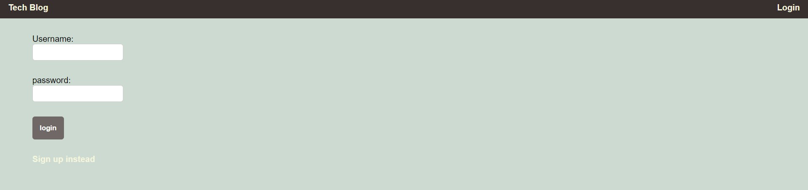

 

  # The Tech Blog 

  ## Description
  A blog site where developers publish post and comment on other post. 

  ## Table of Contents
  * [Installation](#installation)
  * [Usage](#usage)
  * [License](#license)
  * [Questions](#questions)
  

  ## Installation
  1. install express-handlers
  2. install MySQL2
  3. install sequalize
  4. install dotenv package 
  5. install bcrypt package
  6. instal express-session
  7. insatll connect-session-sequalize 

  ## Usage
  A place when developers can share information about web development.
   
  This is a ideally what the application looks like. 
  
   
  Deployed Link: https://enigmatic-eyrie-21247.herokuapp.com/login

  ## License
  This licence is covered undered (https://opensource.org/licenses/MIT).
  

  ## Questions
  If you have any additional questions, please reach out to me. 
  You can reachout to me at my GitHub profile, which is [reaganjoseph26](https://github.com/reaganjoseph26).
  Also, you can reach out to me by email. My email address is reaganjoseph26@yahoo.com. 
  